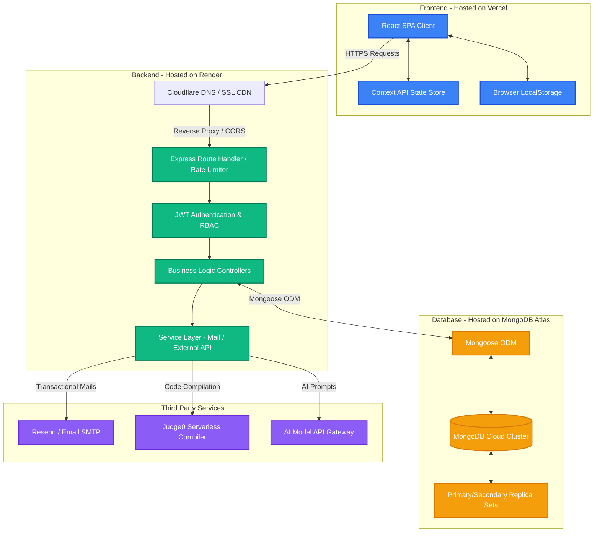
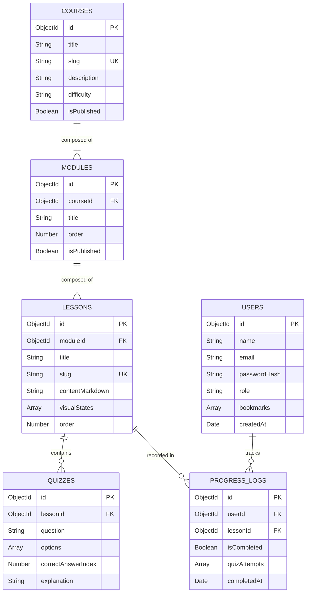
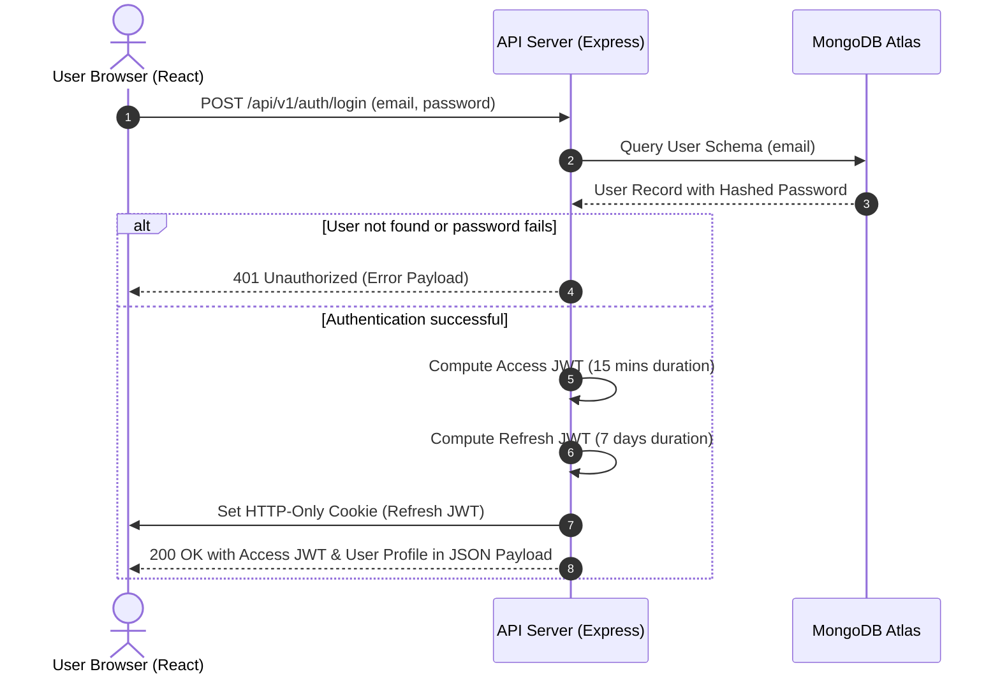
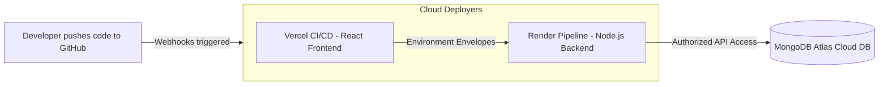
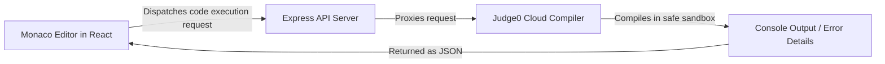
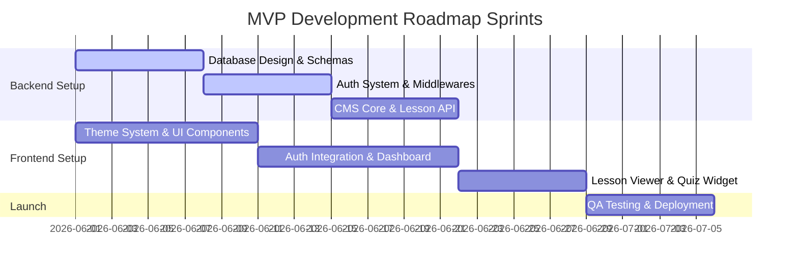

# NoobSyte: Production-Ready MERN Software Architecture Document
> **Brand & System Specification**  
> **Target Platform:** Java & DSA Learning-First System for Beginners  
> **Architect & Mentor:** Antigravity (Google DeepMind Team)  

---

## TABLE OF CONTENTS
1. [Product Requirements Document (PRD)](#1-product-requirements-document-prd)
2. [System Architecture](#2-system-architecture)
3. [Database Design](#3-database-design)
4. [Frontend Architecture](#4-frontend-architecture)
5. [Backend Architecture](#5-backend-architecture)
6. [Authentication & Authorization System](#6-authentication--authorization-system)
7. [Admin Panel Design](#7-admin-panel-design)
8. [Content Management System (CMS)](#8-content-management-system-cms)
9. [API Specification](#9-api-specification)
10. [User Features Specification](#10-user-features-specification)
11. [UI/UX Design & Accessibility](#11-uiux-design--accessibility)
12. [Deployment & DevOps Guide](#12-deployment--devops-guide)
13. [SEO & Indexing Strategy](#13-seo--indexing-strategy)
14. [Monetization Architecture](#14-monetization-architecture)
15. [Innovative Roadmap Features](#15-innovative-roadmap-features)
16. [MVP Development Roadmap & Sprints](#16-mvp-development-roadmap--sprints)

---

## 1. PRODUCT REQUIREMENTS DOCUMENT (PRD)

### Vision
To democratize computer science education by bridging the gap between dry academic textbooks and high-pressure competitive programming platforms. **NoobSyte** focuses on making Java and Data Structures & Algorithms (DSA) approachable, visual, and highly interactive for complete beginners, laying a robust foundation for their career development.

### Core Value Propositions
*   **Concepts Before Syntax:** Heavy emphasis on the *why* and *how* before writing raw code.
*   **Real-Life Analogies:** Every complex DSA concept is mapped to a tangible real-life scenario (e.g., Stack = pile of plates, Queue = ticketing line).
*   **Zero-Config Visual Learning:** Micro-visualizations built directly into lessons to show memory layouts (Stack vs. Heap, Reference variables).
*   **Frictionless Progress:** Short, gamified micro-lessons followed by immediate self-assessment quizzes to validate learning.

### Target User Personas
1.  **Arjun (The B.Tech/Diploma Beginner):** 19-year-old student starting college. Has zero prior coding experience, feels intimidated by standard university courses, and needs a gentle, step-by-step roadmap to master Java.
2.  **Siddharth (The Placement Prep Aspirant):** 21-year-old engineering student preparing for campus recruitment drives. He knows basic syntax but struggles with logic building, DSA implementation, and whiteboard interview explanations.
3.  **Pooja (The Career Transitioner):** 25-year-old non-CS graduate transitioning into a software role. Needs flexible, asynchronous learning with clear certificates to prove her skills.

### Feature Matrix (MVP vs. Phase 2)

| Feature | Description | MVP | Phase 2 | Priority |
| :--- | :--- | :---: | :---: | :---: |
| **Interactive Lessons** | Rich-text markdown lectures with styled Java code blocks, tabs for real-world analogies, and interactive visual charts. | Yes | Yes | Critical |
| **Core Quizzes** | Multiple-choice questions embedded directly inside lessons to test knowledge retention. | Yes | Yes | High |
| **User Dashboard** | Daily streak trackers, overall syllabus completion percentages, and recent lessons quick-access. | Yes | Yes | High |
| **Bookmarks & Notes** | Allowing users to pin lessons or specific code snippets for quick revision. | Yes | Yes | Medium |
| **Fuzzy Search** | Dynamic indexing of courses, modules, and concepts for instantaneous discovery. | Yes | Yes | Medium |
| **Interactive Visualizer** | Interactive canvas/SVG widget showing step-by-step execution of Arrays, Lists, Stacks, and Trees. | No | Yes | High |
| **Web-Based Sandbox** | Sandbox browser-based Java compilation environment utilizing a secure backend. | No | Yes | Medium |
| **AI Study Tutor** | Context-aware GPT/Claude-powered study buddy inside lessons to explain hard blocks of code. | No | Yes | Low |

---

## 2. SYSTEM ARCHITECTURE

NoobSyte utilizes a layered, modern decoupling strategy with React on the client and Express/Node on the server, backing into a managed MongoDB database.

### System Topology Diagram



### Data Flow Patterns
1.  **Request-Response Cycle:**
    *   The user requests a lesson resource. The React client intercepts the routing locally via React Router, renders the shell layout, and triggers an asynchronous Axios call (`GET /api/v1/lessons/:slug`) appended with a Bearer Token (`Authorization: Bearer <JWT>`).
    *   Express parses the request, checks the Authorization header via the `protect` middleware, extracts `req.user.id`, validates active session details, and passes execution to `lessonController.getLessonBySlug`.
    *   Mongoose executes a read query targeting a secondary read replica.
    *   The backend responds with a standard `200 OK` JSON envelope payload. The React client updates its local context state, rendering the rich visual interface.

2.  **State Updation & Telemetry Pattern:**
    *   When a user answers an embedded quiz, an asynchronous payload (`POST /api/v1/progress/quiz-submit`) containing `quizId` and `selectedOption` is dispatched.
    *   The backend calculates the score, updates the database, creates a progress milestone if passed, and returns the computed accuracy metrics instantly.

---

## 3. DATABASE DESIGN

MongoDB Atlas serves as the core system of record. To support the visual progress trees and structured curriculum, we use a hybrid database design combining **embedded documents** for highly-cohesive entities (like quiz options) and **referenced collections** for heavy-growth entities (like progress logs and user metadata).

### Database Entity Relationship Diagram (ERD)



### Collection Schemas & Mongoose Models

#### User Schema (`src/models/User.js`)
```javascript
const mongoose = require('mongoose');
const bcrypt = require('bcryptjs');

const UserSchema = new mongoose.Schema({
  name: {
    type: String,
    required: [true, 'Please provide your name'],
    trim: true,
    maxlength: [50, 'Name cannot exceed 50 characters']
  },
  email: {
    type: String,
    required: [true, 'Please provide your email'],
    unique: true,
    lowercase: true,
    match: [
      /^\w+([\.-]?\w+)*@\w+([\.-]?\w+)*(\.\w{2,3})+$/,
      'Please provide a valid email address'
    ]
  },
  password: {
    type: String,
    required: [true, 'Please provide a password'],
    minlength: [8, 'Password must be at least 8 characters long'],
    select: false
  },
  role: {
    type: String,
    enum: ['user', 'moderator', 'admin'],
    default: 'user'
  },
  bookmarks: [{
    type: mongoose.Schema.Types.ObjectId,
    ref: 'Lesson'
  }],
  passwordResetToken: String,
  passwordResetExpires: Date,
  isEmailVerified: {
    type: Boolean,
    default: false
  },
  createdAt: {
    type: Date,
    default: Date.now
  }
}, { timestamps: true });

// Pre-save password hashing middleware
UserSchema.pre('save', async function(next) {
  if (!this.isModified('password')) return next();
  const salt = await bcrypt.genSalt(12);
  this.password = await bcrypt.hash(this.password, salt);
  next();
});

// Instance method for password verification
UserSchema.methods.comparePassword = async function(candidatePassword, userPassword) {
  return await bcrypt.compare(candidatePassword, userPassword);
};

module.exports = mongoose.model('User', UserSchema);
```

#### Course Schema (`src/models/Course.js`)
```javascript
const mongoose = require('mongoose');

const CourseSchema = new mongoose.Schema({
  title: {
    type: String,
    required: [true, 'Course title is required'],
    unique: true,
    trim: true
  },
  slug: {
    type: String,
    unique: true,
    lowercase: true
  },
  description: {
    type: String,
    required: [true, 'Course description is required']
  },
  difficulty: {
    type: String,
    enum: ['beginner', 'intermediate', 'advanced'],
    default: 'beginner'
  },
  isPublished: {
    type: Boolean,
    default: false
  }
}, { timestamps: true });

// Auto-generate dynamic slugs on save
CourseSchema.pre('save', function(next) {
  if (!this.isModified('title')) return next();
  this.slug = this.title.toLowerCase().replace(/[^a-zA-Z0-9]+/g, '-');
  next();
});

module.exports = mongoose.model('Course', CourseSchema);
```

#### Module Schema (`src/models/Module.js`)
```javascript
const mongoose = require('mongoose');

const ModuleSchema = new mongoose.Schema({
  course: {
    type: mongoose.Schema.Types.ObjectId,
    ref: 'Course',
    required: [true, 'Module must belong to a Course']
  },
  title: {
    type: String,
    required: [true, 'Module title is required'],
    trim: true
  },
  order: {
    type: Number,
    required: [true, 'Module chronological order is required']
  },
  isPublished: {
    type: Boolean,
    default: false
  }
});

// Compound index to guarantee uniqueness of order within the same course scope
ModuleSchema.index({ course: 1, order: 1 }, { unique: true });

module.exports = mongoose.model('Module', ModuleSchema);
```

#### Lesson Schema (`src/models/Lesson.js`)
```javascript
const mongoose = require('mongoose');

const LessonSchema = new mongoose.Schema({
  module: {
    type: mongoose.Schema.Types.ObjectId,
    ref: 'Module',
    required: [true, 'Lesson must belong to a Module']
  },
  title: {
    type: String,
    required: [true, 'Lesson title is required'],
    trim: true
  },
  slug: {
    type: String,
    unique: true,
    lowercase: true
  },
  content: {
    type: String, // Dynamic markdown content
    required: [true, 'Lesson rich content markdown is required']
  },
  visualizations: [{
    step: Number,
    memorySnapshot: {
      stack: [{ variable: String, value: String }],
      heap: [{ address: String, objectType: String, fields: mongoose.Schema.Types.Mixed }]
    },
    label: String
  }],
  order: {
    type: Number,
    required: [true, 'Lesson chronological order is required']
  }
}, { timestamps: true });

LessonSchema.index({ module: 1, order: 1 }, { unique: true });
LessonSchema.index({ title: 'text', content: 'text' }); // High-performance fuzzy text queries index

LessonSchema.pre('save', function(next) {
  if (!this.isModified('title')) return next();
  this.slug = this.title.toLowerCase().replace(/[^a-zA-Z0-9]+/g, '-');
  next();
});

module.exports = mongoose.model('Lesson', LessonSchema);
```

#### Quiz Schema (`src/models/Quiz.js`)
```javascript
const mongoose = require('mongoose');

const QuizSchema = new mongoose.Schema({
  lesson: {
    type: mongoose.Schema.Types.ObjectId,
    ref: 'Lesson',
    required: [true, 'Quiz must be connected to a specific Lesson'],
    unique: true // 1-to-1 mapping for in-context lesson evaluations
  },
  questions: [{
    questionText: {
      type: String,
      required: [true, 'Question description is required']
    },
    options: [{
      text: { type: String, required: true },
      isCode: { type: Boolean, default: false }
    }],
    correctAnswerIndex: {
      type: Number,
      required: [true, 'Identify the correct index'],
      min: 0
    },
    explanation: {
      type: String,
      required: [true, 'Provide a beginner-friendly logical explanation']
    }
  }]
}, { timestamps: true });

module.exports = mongoose.model('Quiz', QuizSchema);
```

#### Progress Schema (`src/models/Progress.js`)
```javascript
const mongoose = require('mongoose');

const ProgressSchema = new mongoose.Schema({
  user: {
    type: mongoose.Schema.Types.ObjectId,
    ref: 'User',
    required: [true, 'Progress records require an associated User']
  },
  lesson: {
    type: mongoose.Schema.Types.ObjectId,
    ref: 'Lesson',
    required: [true, 'Progress records require an associated Lesson']
  },
  isCompleted: {
    type: Boolean,
    default: false
  },
  quizScores: [{
    attemptNumber: Number,
    score: Number,
    passed: Boolean,
    timestamp: { type: Date, default: Date.now }
  }],
  completedAt: Date
}, { timestamps: true });

// Create a compound unique index ensuring a user only has one progress log per lesson
ProgressSchema.index({ user: 1, lesson: 1 }, { unique: true });

module.exports = mongoose.model('Progress', ProgressSchema);
```

---

## 4. FRONTEND ARCHITECTURE

NoobSyte's client-side architecture is built for split-second rendering, dynamic state hydration, and modular code isolation using clean folders.

### Folder Structure Blueprint

```
noobsyte-frontend/
├── public/
│   ├── favicon.ico
│   └── sitemap.xml
├── src/
│   ├── assets/
│   │   ├── css/
│   │   │   └── variables.css     # Global layout, color, typography variables
│   │   └── images/
│   ├── components/
│   │   ├── common/
│   │   │   ├── Navbar.jsx        # Navigation bar
│   │   │   ├── Footer.jsx        # Footer layout
│   │   │   ├── Button.jsx        # Customizable premium buttons
│   │   │   └── Card.jsx          # Reusable content card container
│   │   ├── lessons/
│   │   │   ├── MarkdownRenderer.jsx # Specialized PrismJS-integrated wrapper
│   │   │   ├── VisualMemoryMap.jsx  # Interactive SVG representation of Stack/Heap
│   │   │   └── QuizWidget.jsx    # Stateful MCQ widget
│   │   └── dashboard/
│   │       ├── StreakTracker.jsx # Custom visual streak matrix
│   │       └── RoadmapTree.jsx   # Curated visual learning tracks
│   ├── context/
│   │   ├── AuthContext.jsx       # Holds current user profiles & active session tokens
│   │   └── LearningContext.jsx   # Manages active curriculum tree progress
│   ├── hooks/
│   │   ├── useAuth.js            # Fast auth contextual hooks
│   │   └── useAxiosPrivate.js    # Intercepts outgoing requests to append JWT headers
│   ├── pages/
│   │   ├── Home.jsx              # Landing page
│   │   ├── Dashboard.jsx         # Personalized user cockpit
│   │   ├── CourseCatalog.jsx     # Course catalogs page
│   │   ├── LessonViewer.jsx      # Core visual reading split pane
│   │   ├── Login.jsx
│   │   └── Register.jsx
│   ├── services/
│   │   ├── api.js                # Core Axios client instance setup
│   │   └── apiEndpoints.js       # Constant endpoints mappings
│   ├── utils/
│   │   └── helpers.js            # Utility formatting engines
│   ├── App.css
│   ├── App.jsx
│   └── main.jsx
├── package.json
└── vite.config.js
```

### Global State Management Pattern (`AuthContext.jsx`)
```javascript
import React, { createContext, useState, useEffect } from 'react';
import axios from 'axios';

export const AuthContext = createContext({});

export const AuthProvider = ({ children }) => {
  const [user, setUser] = useState(null);
  const [token, setToken] = useState(localStorage.getItem('ns_jwt_token'));
  const [loading, setLoading] = useState(true);

  useEffect(() => {
    const fetchCurrentUser = async () => {
      if (!token) {
        setLoading(false);
        return;
      }
      try {
        axios.defaults.headers.common['Authorization'] = `Bearer ${token}`;
        const response = await axios.get(`${import.meta.env.VITE_API_URL}/api/v1/users/me`);
        setUser(response.data.data.user);
      } catch (error) {
        console.error('Session validation failed. Clearing tokens.');
        logout();
      } finally {
        setLoading(false);
      }
    };
    fetchCurrentUser();
  }, [token]);

  const login = async (email, password) => {
    setLoading(true);
    try {
      const response = await axios.post(`${import.meta.env.VITE_API_URL}/api/v1/auth/login`, { email, password });
      const { token: userToken, user: userData } = response.data;
      localStorage.setItem('ns_jwt_token', userToken);
      setToken(userToken);
      setUser(userData);
      axios.defaults.headers.common['Authorization'] = `Bearer ${userToken}`;
      return { success: true };
    } catch (error) {
      return {
        success: false,
        error: error.response?.data?.message || 'Login credentials invalid'
      };
    } finally {
      setLoading(false);
    }
  };

  const logout = () => {
    localStorage.removeItem('ns_jwt_token');
    setToken(null);
    setUser(null);
    delete axios.defaults.headers.common['Authorization'];
  };

  return (
    <AuthContext.Provider value={{ user, token, loading, login, logout, setUser }}>
      {children}
    </AuthContext.Provider>
  );
};
```

---

## 5. BACKEND ARCHITECTURE

NoobSyte's Express server follows the **Layered Architecture (Controller-Service-Repository)** pattern to ensure scalability, security, and a strict separation of concerns.

### Directory Structure Blueprint

```
noobsyte-backend/
├── src/
│   ├── config/
│   │   ├── db.js             # Mongoose connection instantiation engine
│   │   └── environment.js    # Env variables validation and exports
│   ├── controllers/
│   │   ├── authController.js # Handles registration, log-ins, resets
│   │   ├── courseController.js
│   │   └── progressController.js
│   ├── middlewares/
│   │   ├── auth.js           # JWT authentication and Role checks
│   │   ├── error.js          # Central centralized Express middleware error handler
│   │   └── rateLimiter.js    # DDOS protection limiting traffic rates
│   ├── models/
│   │   ├── User.js
│   │   ├── Course.js
│   │   └── Lesson.js
│   ├── routes/
│   │   ├── authRoutes.js
│   │   ├── courseRoutes.js
│   │   └── progressRoutes.js
│   ├── services/
│   │   ├── emailService.js   # Custom email SMTP integrations
│   │   └── codeRunner.js     # Sandbox compiler bridge
│   ├── utils/
│   │   ├── AppError.js       # Customized error handling class
│   │   └── asyncHandler.js   # Wrapper bypassing try-catch loops
│   ├── app.js                # Core middlewares parsing configuration
│   └── server.js             # Listens to socket requests
├── package.json
└── README.md
```

### Centralized Exception Architecture (`AppError.js`)
```javascript
class AppError extends Error {
  constructor(message, statusCode) {
    super(message);
    this.statusCode = statusCode;
    this.status = `${statusCode}`.startsWith('4') ? 'fail' : 'error';
    this.isOperational = true; // Flag identifying runtime predicted errors

    Error.captureStackTrace(this, this.constructor);
  }
}

module.exports = AppError;
```

### Global Express Error Dispatcher Middleware (`src/middlewares/error.js`)
```javascript
const AppError = require('../utils/AppError');

const handleCastErrorDB = err => {
  const message = `Invalid format for resource parameter: ${err.value}.`;
  return new AppError(message, 400);
};

const handleDuplicateFieldsDB = err => {
  const value = err.errmsg.match(/(["'])(\\?.)*?\1/)[0];
  const message = `Duplicate resource field value: ${value}. Please use another.`;
  return new AppError(message, 400);
};

const handleValidationErrorDB = err => {
  const errors = Object.values(err.errors).map(el => el.message);
  const message = `Invalid data input payload parameters: ${errors.join('. ')}`;
  return new AppError(message, 400);
};

const handleJWTError = () => new AppError('Invalid user session token. Log in again.', 401);
const handleJWTExpiredError = () => new AppError('User session expired. Log in again.', 401);

const sendErrorDev = (err, res) => {
  res.status(err.statusCode).json({
    status: err.status,
    error: err,
    message: err.message,
    stack: err.stack
  });
};

const sendErrorProd = (err, res) => {
  if (err.isOperational) {
    res.status(err.statusCode).json({
      status: err.status,
      message: err.message
    });
  } else {
    console.error('CRITICAL UNCAUGHT ENGINE SYSTEM FAULT:', err);
    res.status(500).json({
      status: 'error',
      message: 'A critical system anomaly occurred.'
    });
  }
};

module.exports = (err, req, res, next) => {
  err.statusCode = err.statusCode || 500;
  err.status = err.status || 'error';

  if (process.env.NODE_ENV === 'development') {
    sendErrorDev(err, res);
  } else {
    let error = { ...err };
    error.message = err.message;

    if (err.name === 'CastError') error = handleCastErrorDB(error);
    if (err.code === 11000) error = handleDuplicateFieldsDB(error);
    if (err.name === 'ValidationError') error = handleValidationErrorDB(error);
    if (err.name === 'JsonWebTokenError') error = handleJWTError();
    if (err.name === 'TokenExpiredError') error = handleJWTExpiredError();

    sendErrorProd(error, res);
  }
};
```

---

## 6. AUTHENTICATION & AUTHORIZATION SYSTEM

We utilize a double-guard JWT strategy (Access Token via memory header, Refresh Token stored securely in an HTTP-only, secure, SameSite cookie) or a standard production token system. Below is our authentication flow.

### Login Flow Sequence



### Authorization Protection Middleware (`src/middlewares/auth.js`)
```javascript
const jwt = require('jsonwebtoken');
const { promisify } = require('util');
const User = require('../models/User');
const AppError = require('../utils/AppError');
const asyncHandler = require('../utils/asyncHandler');

exports.protect = asyncHandler(async (req, res, next) => {
  let token;
  if (req.headers.authorization && req.headers.authorization.startsWith('Bearer')) {
    token = req.headers.authorization.split(' ')[1];
  }

  if (!token) {
    return next(new AppError('Access denied. Authentication token is missing.', 401));
  }

  // Verify token integrity
  const decoded = await promisify(jwt.verify)(token, process.env.JWT_SECRET);

  // Check if user still exists
  const currentUser = await User.findById(decoded.id);
  if (!currentUser) {
    return next(new AppError('Owner session reference key no longer exists.', 401));
  }

  // Inject user entity inside the request context
  req.user = currentUser;
  next();
});

// Role-Based Access Control (RBAC) middleware generator
exports.restrictTo = (...roles) => {
  return (req, res, next) => {
    if (!roles.includes(req.user.role)) {
      return next(new AppError('Forbidden: Access permissions insufficient.', 403));
    }
    next();
  };
};
```

---

## 7. ADMIN PANEL DESIGN

The Admin Panel serves as NoobSyte's CMS engine, allowing administrators and curators to add educational modules without writing database code manually.

### Admin Controller Actions (`src/controllers/adminController.js`)
```javascript
const Course = require('../models/Course');
const Module = require('../models/Module');
const Lesson = require('../models/Lesson');
const User = require('../models/User');
const asyncHandler = require('../utils/asyncHandler');
const AppError = require('../utils/AppError');

// Course hierarchy builder
exports.createCourse = asyncHandler(async (req, res, next) => {
  const newCourse = await Course.create(req.body);
  res.status(201).json({
    status: 'success',
    data: { course: newCourse }
  });
});

exports.createModule = asyncHandler(async (req, res, next) => {
  const newModule = await Module.create(req.body);
  res.status(201).json({
    status: 'success',
    data: { module: newModule }
  });
});

exports.createLesson = asyncHandler(async (req, res, next) => {
  const newLesson = await Lesson.create(req.body);
  res.status(201).json({
    status: 'success',
    data: { lesson: newLesson }
  });
});

// System Analytics Aggregation Engine
exports.getPlatformAnalytics = asyncHandler(async (req, res, next) => {
  const userCounts = await User.countDocuments();
  const courseCounts = await Course.countDocuments();
  
  // Mongoose Aggregation pipelines checking metrics
  const activeStreakStats = await User.aggregate([
    { $group: { _id: '$role', count: { $sum: 1 } } }
  ]);

  res.status(200).json({
    status: 'success',
    data: {
      metrics: {
        totalUsers: userCounts,
        totalCourses: courseCounts,
        roleDistributions: activeStreakStats
      }
    }
  });
});
```

---

## 8. CONTENT MANAGEMENT SYSTEM (CMS)

Lessons in NoobSyte are dynamic documents featuring integrated visual and assessment states. Rather than building a heavy external UI interface, the curriculum is stored as formatted Markdown/HTML paired with structured JSON configurations.

### CMS Storage Architecture Map

```mermaid
graph TD
    subgraph Lesson JSON Object in Database
        MD[content: "Markdown Body"]
        Code[Code Snippets inside Markdown]
        Vis[visualizations Array: Stack & Heap snapshots]
    end
    
    subgraph UI Render Cycle
        Vite[Vite React Client Engine]
        Parser[DOMParser Content Splitter]
        R_MD[HTML Parser Engine]
        Prism[PrismJS Syntax Tokenizer]
        V_SVG[Custom SVG Memory Drawer]
    end

    MD -->|Parsed by| Parser
    Parser -->|Theory| R_MD
    Parser -->|Analogy| R_MD
    Code -->|Highlighted by| Prism
    Vis -->|Animated by| V_SVG
    R_MD --> Vite
    Prism --> Vite
    V_SVG --> Vite
```

*   **Syntax Highlighting:** Written in standard markdown format (````java ... ````). The React frontend converts code blocks into syntax-highlighted HTML spans using `prismjs` or `react-syntax-highlighter`.
*   **Visualizations Schema:** Standard JSON maps specifying variables, reference objects in the heap, pointers, and descriptive labels.
*   **Dynamic HTML Tab-Splitting (`DOMParser`):** To avoid duplicating content in the database, the backend feeds a single comprehensive lesson HTML body. The React client dynamically processes this HTML at runtime using the browser's native `DOMParser`. It scans for `<h2>` or `<h3>` headers matching "analogy" or "real-life analogy" and automatically splits the document into a **Theory** section and an **Analogy** section. This content is then displayed under separate, interactive tabs on the UI.
*   **Layout Adaptability:** The rendering engine checks the presence of JVM memory visualization steps (`activeLesson.visualizations`).
    *   If visualization steps are present, a two-column `split-pane-layout` is rendered, displaying the SVG visual memory map simulator side-by-side with the narrative content.
    *   If no visual blueprints are configured for the lesson, it dynamically shifts to `single-pane-layout` where the narrative pane takes up 100% of the available width (`full-width-pane`), optimizing screen real estate for reading.

---

## 9. API SPECIFICATION

All endpoints follow strict REST API conventions, standard payload formatting, and structural validation routines.

### Global Configuration
*   **Base URL:** `https://api.bugsyte.com/api/v1` (Production) / `http://localhost:5000/api/v1` (Development)
*   **Default Headers:**
    *   `Content-Type: application/json`
    *   `Authorization: Bearer <JWT_ACCESS_TOKEN>`

### Core REST Endpoints List

#### 1. Authentication
*   **`POST /auth/register`**
    *   *Description:* Creates a new user profile on the platform.
    *   *Payload Validator (Joi equivalent):*
        ```json
        {
          "name": "Arjun Kumar",
          "email": "arjun@noobsyte.com",
          "password": "SecurePassword123"
        }
        ```
    *   *Success Response (201 Created):*
        ```json
        {
          "status": "success",
          "token": "eyJhbGciOiJIUzI1NiIsInR5...",
          "data": {
            "user": {
              "id": "60d01f01229f342b44ef91a2",
              "name": "Arjun Kumar",
              "email": "arjun@noobsyte.com",
              "role": "user"
            }
          }
        }
        ```

*   **`POST /auth/login`**
    *   *Description:* Validates user credentials and returns active session tokens.
    *   *Payload:*
        ```json
        {
          "email": "arjun@noobsyte.com",
          "password": "SecurePassword123"
        }
        ```

#### 2. Curriculum Resources
*   **`GET /courses`**
    *   *Description:* Fetch all published courses.
    *   *Success Response (200 OK):*
        ```json
        {
          "status": "success",
          "results": 2,
          "data": {
            "courses": [
              {
                "_id": "60d01f01229f342b44ef91b0",
                "title": "Java Fundamentals for Beginners",
                "slug": "java-fundamentals-for-beginners",
                "description": "Learn object-oriented programming concepts using real-life examples.",
                "difficulty": "beginner"
              }
            ]
          }
        }
        ```

*   **`GET /lessons/:slug`**
    *   *Description:* Retrieve a lesson's dynamic markdown content, visual configurations, and attached quizzes.
    *   *Success Response (200 OK):*
        ```json
        {
          "status": "success",
          "data": {
            "lesson": {
              "_id": "60d01f01229f342b44ef91c5",
              "title": "Java References & Memory Layout",
              "slug": "java-references-memory-layout",
              "content": "# Understanding References\nJava variables don't hold objects; they hold remote controls (references) that point to objects on the Heap...",
              "visualizations": [
                {
                  "step": 1,
                  "label": "Declaring the reference: User user1;",
                  "memorySnapshot": {
                    "stack": [{ "variable": "user1", "value": "null" }],
                    "heap": []
                  }
                }
              ]
            }
          }
        }
        ```

#### 3. Progress Tracking
*   **`POST /progress/lessons/:id/complete`**
    *   *Description:* Marks a lesson as read, advancing the user's progress.
    *   *Success Response (200 OK):*
        ```json
        {
          "status": "success",
          "message": "Lesson progress updated successfully.",
          "data": {
            "isCompleted": true,
            "xpGained": 50
          }
        }
        ```

---

## 10. USER FEATURES SPECIFICATION

### User Cockpit Dashboard
A clean, visual interface featuring three key components:
1.  **Curriculum Tree Guide:** A graphical map displaying completed lessons in green, in-progress lessons with glowing borders, and locked lessons in gray.
2.  **Telemetry Widget:** A dynamic activity log showing daily progress streaks and total XP gained.
3.  **Quick Resume Interface:** A prominent, single-click button that dynamically loads the user's last unfinished lesson.

### Search & Navigation Engine
*   **Fuzzy Searching Strategy:** Implemented using MongoDB's text indexes (`$text`) on courses and lessons, allowing users to find relevant content even with typos (e.g., searching for "linkedlist" returns "Linked List").
*   **State-Preserved Course Navigation:** To provide an intuitive learning flow, navigation states (such as the active workspace tab `activeCatalogTab` and expanded course slug `selectedCourseSlug`) are lifted to the root `App.jsx` component. When a user is in the "Syllabus" section, drills down into a specific module/lesson, and then clicks the back button, the platform returns them precisely to the "Syllabus" tab with the same course expanded, rather than resetting their navigation to the "Learn & Roadmap" home tab.

---

## 11. UI/UX DESIGN & ACCESSIBILITY

To keep beginners engaged, NoobSyte's design system prioritizes high-contrast visual cues, modern typography, and a clean, clutter-free layout.

### Color Palette Architecture (HSL Variables)
```css
:root {
  /* Premium Slate Dark Mode Palette */
  --bg-primary: hsl(220, 24%, 10%);       /* Rich Dark Background */
  --bg-secondary: hsl(222, 22%, 15%);     /* Elevation Containers Cards */
  --bg-tertiary: hsl(223, 19%, 20%);      /* Accent Borders UI controls */
  
  /* Primary Branding Colors */
  --brand-cyan: hsl(180, 100%, 45%);       /* Primary Interactive elements */
  --brand-violet: hsl(265, 89%, 65%);     /* Secondary Accent tags buttons */
  
  /* Status Color Indication */
  --accent-success: hsl(150, 76%, 50%);   /* Correct Answers, Progress */
  --accent-warning: hsl(35, 92%, 55%);    /* Streak Indicators, Warnings */
  --accent-error: hsl(0, 84%, 60%);       /* Error, Incorrect Answers */

  /* Modern Interface Typography Scale */
  --font-family-sans: 'Outfit', -apple-system, BlinkMacSystemFont, "Segoe UI", Roboto, sans-serif;
  --font-family-mono: 'JetBrains Mono', monospace;
}
```

### Typography Hierarchy

| Level | Size | Weight | Line Height | Usage |
| :--- | :--- | :--- | :--- | :--- |
| **`h1`** | `2.25rem` (36px) | `700` (Bold) | `1.2` | Hero Section Titles, Lesson Headers |
| **`h2`** | `1.5rem` (24px) | `600` (SemiBold) | `1.3` | Module Headings, Panel Sections |
| **`body`** | `1rem` (16px) | `400` (Regular) | `1.6` | Narrative Content, Interactive Examples |
| **`code`** | `0.9rem` (14.4px)| `400` (Regular) | `1.5` | Code Snippets, In-Line Terminal references |

---

## 12. DEPLOYMENT & DEVOPS GUIDE



### 1. Codebase Architecture Setup
To keep deployment simple and clean, the codebase is structured as a **git monorepo**:
```
LearningPlatform/
├── .git/
├── noobsyte-frontend/      # Vite React app
└── noobsyte-backend/       # Node.js/Express server
```

### 2. Database Provisioning (MongoDB Atlas)
1.  Log in to MongoDB Atlas and create a new database cluster using the free tier (**M0 Shared**).
2.  In **Network Access**, add `0.0.0.0/0` to allow connections from Render, or use Render's static outbound IP addresses for extra security.
3.  In **Database Access**, create a database user and generate a secure connection string:
    `mongodb+srv://<username>:<password>@cluster0.abcde.mongodb.net/noobsyte?retryWrites=true&w=majority`

### 3. Backend Deployment (Render)
1.  Log in to Render and create a new **Web Service** linked to your GitHub repository.
2.  Configure the service settings:
    *   **Root Directory:** `noobsyte-backend`
    *   **Build Command:** `npm install`
    *   **Start Command:** `node src/server.js`
3.  Add the environment variables:
    *   `PORT` = `10000`
    *   `NODE_ENV` = `production`
    *   `DATABASE_URL` = `<Your MongoDB Connection String>`
    *   `JWT_SECRET` = `<Secure Hashed Phrase>`
    *   `JWT_EXPIRES_IN` = `1d`

### 4. Frontend Deployment (Vercel)
1.  Log in to Vercel and import your GitHub repository.
2.  Configure the project settings:
    *   **Root Directory:** `noobsyte-frontend`
    *   **Framework Preset:** `Vite`
    *   **Build Command:** `npm run build`
    *   **Output Directory:** `dist`
3.  Add the environment variables:
    *   `VITE_API_URL` = `<Your Render Web Service URL>`
4.  To ensure React Router works correctly when pages are refreshed, add a `vercel.json` file to the root of the frontend folder:
    ```json
    {
      "rewrites": [
        { "source": "/(.*)", "destination": "/index.html" }
      ]
    }
    ```

### 5. Domain Connection & SSL Security
1.  In your domain registrar's DNS settings (e.g., Namecheap, GoDaddy), update the Nameservers to point to **Cloudflare** for free DDoS protection and fast content delivery.
2.  Configure the DNS records:
    *   Add a **CNAME** record for `bugsyte.com` pointing to `cname.vercel-dns.com` (Frontend).
    *   Add an **A** record for the subdomain `api.bugsyte.com` pointing to your Render service's IP address.

---

## 13. SEO & INDEXING STRATEGY

To attract organic search traffic from students looking for help with Java and DSA, NoobSyte is optimized to rank highly on search engines.

### 1. Dynamic Sitemap Generation
The backend automatically updates the `sitemap.xml` file whenever new lessons are published:
```javascript
// Sample script dynamically generating sitemaps
const generateSitemap = async (lessons) => {
  const sitemapHeader = `<?xml version="1.0" encoding="UTF-8"?>\n<urlset xmlns="http://www.sitemaps.org/schemas/sitemap/0.9">\n`;
  const sitemapFooter = `\n</urlset>`;
  const urls = lessons.map(lesson => `
    <url>
      <loc>https://bugsyte.com/courses/java/${lesson.slug}</loc>
      <lastmod>${new Date(lesson.updatedAt).toISOString()}</lastmod>
      <changefreq>monthly</changefreq>
      <priority>0.8</priority>
    </url>
  `).join('');
  return `${sitemapHeader}${urls}${sitemapFooter}`;
};
```

### 2. Structured Data for Google (JSON-LD)
To help search engines understand our content, every lesson includes structured schema markup:
```html
<script type="application/ld+json">
{
  "@context": "https://schema.org",
  "@type": "Course",
  "name": "Java Memory Reference Models",
  "description": "A beginner-friendly guide to understanding variables, reference parameters, Stack, and Heap in Java.",
  "provider": {
    "@type": "Organization",
    "name": "NoobSyte",
    "sameAs": "https://bugsyte.com"
  }
}
</script>
```

---

## 14. MONETIZATION ARCHITECTURE

While NoobSyte's core lessons are completely free, the platform includes a scalable monetization framework to support its running costs.

### Monetization Channels
1.  **Ethical Non-Intrusive Ads:** Lightweight, privacy-focused banner ads placed at the bottom of lessons, styled to match the dark theme and avoid distracting learners.
2.  **Premium Learning Paths:** Users can pay a one-time fee to access advanced courses (e.g., "Cracking the Java Tech Interview") and lock in premium certificates.
3.  **Verified PDF Certificates:** Uses a secure backend service to generate verified completion certificates complete with a unique validation code and QR code.

---

## 15. INNOVATIVE ROADMAP FEATURES

To provide a complete learning experience, we will introduce several interactive tools in Phase 2.

### 1. Web-Assembly & Serverless Code Compiler
Users can write and run Java code directly in their browser without installing anything locally.



*   **Security:** Code runs in isolated sandboxes with strict execution timeouts (2 seconds) to prevent server misuse.

### 2. State-Based DSA Visualizer
An interactive tool that animates data structures in real-time as users modify them:
*   **Technology:** Built using React and SVG/D3 to render memory layouts dynamically.
*   **Visualizations:** Users can watch how nodes are added or removed in Linked Lists, Stacks, Queues, and Binary Search Trees step-by-step.

### 3. Context-Aware AI Study Assistant
An AI tutor built directly into lessons to help users who get stuck:
*   **How it works:** Uses a secure backend server to send the current lesson content and the user's question to the Gemini API (`gemini-2.5-flash`), returning an instant, beginner-friendly explanation.

---

## 16. MVP DEVELOPMENT ROADMAP & SPRINTS

### MVP Agile Sprint Plan (6-Week Timeline)



#### Sprint 1: Foundation (Days 1–7)
*   **Backend:** Set up the Node/Express server, connect to MongoDB Atlas, and create the core schemas (`User`, `Course`, `Module`, `Lesson`).
*   **Frontend:** Initialize the React application with Vite, set up React Router, and establish the HSL variables design system.

#### Sprint 2: Authentication & CMS APIs (Days 8–14)
*   **Backend:** Build the JWT registration, login, and authorization routes. Set up the centralized error handling middleware.
*   **Frontend:** Build the Login/Register views and integrate them with the global `AuthContext` state.

#### Sprint 3: Curriculum API (Days 15–21)
*   **Backend:** Build out the courses, modules, and lessons endpoints. Ensure query optimizations are in place.
*   **Frontend:** Create the course catalog view and responsive dashboard shell.

#### Sprint 4: Lesson Engine & Quiz Widget (Days 22–28)
*   **Backend:** Implement progress tracking endpoints and quiz scoring validation logic.
*   **Frontend:** Build the interactive lesson reader featuring the markdown parser, custom syntax highlighting, and quiz widget.

#### Sprint 5: User Dashboard & Custom Features (Days 29–35)
*   **Frontend:** Build the daily streak matrix, course completion tree trackers, bookmarks page, and search bar.
*   **System:** Write comprehensive integration tests for authentication and progress updates.

#### Sprint 6: Deployment & Optimization (Days 36–42)
*   **DevOps:** Set up automatic deployments on Vercel (Frontend) and Render (Backend). Connect the `bugsyte.com` domain.
*   **SEO:** Set up dynamic sitemaps and add JSON-LD structured data to lessons.

---

## CONCLUDING MENTOR ADVICE
> "Every expert was once a complete beginner. When building **NoobSyte**, focus on delivering a smooth, high-quality experience for your users. Don't worry about building a massive feature set right away. Instead, focus on polished design, helpful visual illustrations, and robust backend APIs. Start with a solid foundation, and the rest will follow. Happy coding!" - *Your Technical Mentor*
